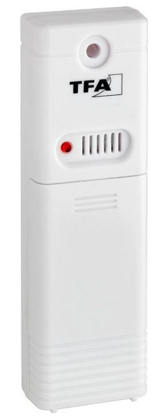
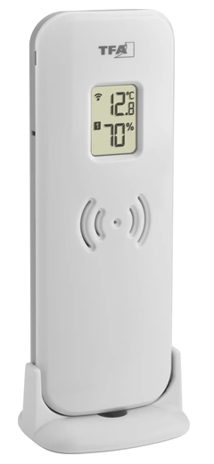

# Get reliable sensor data from TFA Sensors with ESPHOME

## Introduction
Within a home automation project I wanted to acquire the outdoor temperature and humidity, too. An installed outdoor sensor belonging to a simple weather station from TFA Dostmann (some are identical to La Crosse outdoor sensors) already transmits the information at a frequency of 433 MHz.
To make things inexpensive and easy and yet in a nice case I bought a "Sonoff RF-Bridge". Unfortunately it was the bridge in version V2 with a currently not hacked RF-pre-processor. So I decided to bypass the pre-processor like described [here](https://community.home-assistant.io/t/new-sonoff-rf-bridge-board-need-flashing-help/344326/17). At the end this is a standard ESP8266 receiving a simple RF extracted bit stream at a GPIO-pin. Therefore my basic ESPHOME recipe must be valid for every ESPHOME supported device combined with an inexpensive 433 MHz AM-receiver unit (like like RXB6).

Within homeassistant - or via MQTT or other home automation systems  - you can receive data from up to 4 different devices, each providing temperature, humidity and battery state. After some tweaks on ESPHOME's remote_base/rc_switch_protocol.[h|cpp] receiving is very reliable. 

I've successful tested with TFA Dostmann 30.3206.02 and 30.3249.02 devices. I guess it will work with more 30.32XX.XX devices, but maybe their workload is differently encoded. 

   

## Implementation
My solution consists of 5 files, the ESPHOME yaml-file enhanced with 4 C++ extension files and minor but important modifications on ESPHOME's files rc_switch_protocol.[h|cpp]. I've put the modified files from ESPHOME's sources together with lots of unmodified files from the same source in a separate 'external' directory.

My first experiments with ESPHOME's rc_switch_protocol receive implementation did not behave like expected. For a successful receive of a valid pulse train I had to use a huge timing tolerance of 55 percent of the expected pulse lengths. Receiving was very unreliable. The raw output shows at the front of each pulse train one up to four sync pulses but the rc_switch_protocol implementation solely expects one sync pulse. So I modified 'rc_switch_protocol.cpp' to accept up to 5 sync pulses before break.

To receive a pulse sequence, `rc_switch_protocol` only offers the option with `binary_sensor` to configure a user-defined protocol. No such solution exists for 'sensor' devices. Therefore, I added my measured and calculated timings to `RC_SWITCH_PROTOCOLS[]`. `RCSwitchBase(770, 790, 260, 480, 480, 260, false)` works well with 25% tolerance.

To verify the data's sanity I've added a backwards compatible data length (size) to 

    struct RCSwitchData {
      uint64_t code;
      uint8_t protocol;
      uint8_t size;
    
      bool operator==(const RCSwitchData &rhs) const { return code == rhs.code && protocol == rhs.protocol && size == rhs.size; }
    };

Inside 'tfa_30_xx.[h|cpp]' all decoding and sanity checks of sensor data is handled. It is expected that a valid pulse train is received successively two times and the count of received bits and the checksum matches.

The sensor device's address field is ignored since it changes with every power down of the device.

I used ESPHOME at the command line. ESPHOME was installed with pipenv.

## Use
  * clone the repository
  * cd into the created directory
  * call 'pipenv install'
  * copy src/secrets-template.yaml to src/secrets.yaml
  * call 'pipenv shell'
  * call 'esphome compile src/tfagateway.yaml'
  
If the compilation succeeds:
  * Modify src/secrets.yaml with your own credentials
  * call again 'esphome compile src/tfagateway.yaml'

If the compilation succeeds again, do:
  * Connect your target gateway device physically to your computer (USB or serial)
  * call 'esphome run src/tfagateway.yaml' and select the first time the serial device. If your credentials match the next times you can update over the air (OTA)

If everything succeds you will see printouts like this:

    [12:45:02.273][I][rc_switch custom: :093]: address 52, channel 1, temp 14.4, hum 42, battery 1, checksum 106, computed_checksum 106
    [12:45:37.830][D][on_rc_switch: :076]: protocol 4, code 0x0000000000000000, size 10
    [12:45:47.273][D][on_rc_switch: :076]: protocol 1, code 0x000001ea04489b48, size 41
    [12:45:47.273][D][on_rc_switch: :076]: protocol 1, code 0x000001ea04489b48, size 41
    [12:45:47.313][I][rc_switch custom: :093]: address 245, channel 0, temp 4.8, hum 77, battery 1, checksum 164, computed_checksum 164
    [12:45:47.313][D][sensor:129]: 'Temperature-1' >> 4.8 °C
    

## Future goals
  * Extend `rc_switch-protocol` and `remote_base` to allow the configuration of a custom protocol, similar like to `binary_sensor`.
  * Try to get my changes inside the ESPHOME sources merged into the origin sources 
  * Design suitable hardware to avoid modifications to existing hardware and easier use with ESPHOME. 
  * Maybe, make the decoder configurable for various RF-based sensors.

## Important or interesting links
[How to modify a SonOff RF-Bridge](https://community.home-assistant.io/t/new-sonoff-rf-bridge-board-need-flashing-help/344326/17)

[rtl433 - generic data receiver (not for ESPHOME)](https://github.com/merbanan/rtl_433/blob/master/src/devices/tfa_30_3221.c)

[How the telegrams are decoded (not for ESPHOME)](https://github.com/emax73/TFA-Spring-sensor-30.3206.02/tree/master)

[Another aproach for 433 MHz sensors](https://github.com/DonKracho/ESPHome-component-433MHz-Sensor-Hub)

## Postscript
Please respond if you have any suggestion or improvement or only if you like my little project.

